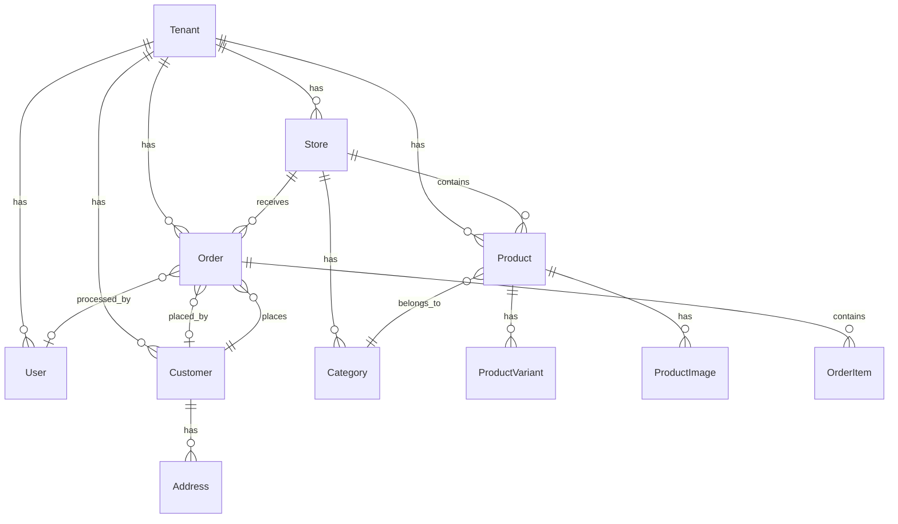

# Cartify Architecture Overview

## 🏗️ System Architecture

Cartify is built using Clean Architecture principles with a multi-tenant design pattern. The system is organized into distinct layers with clear separation of concerns.

### Architecture Layers

```
┌─────────────────────────────────────────────────────────────┐
│                    Presentation Layer                       │
├─────────────────────────────────────────────────────────────┤
│  Cartify.Platform  │  Cartify.Storefront  │  Cartify.Admin  │
│   (Main Platform)  │   (Customer Store)   │ (Vendor Admin)  │
└─────────────────────────────────────────────────────────────┘
┌─────────────────────────────────────────────────────────────┐
│                    Application Layer                        │
├─────────────────────────────────────────────────────────────┤
│              Cartify.Application (CQRS + Services)          │
└─────────────────────────────────────────────────────────────┘
┌─────────────────────────────────────────────────────────────┐
│                     Domain Layer                            │
├─────────────────────────────────────────────────────────────┤
│              Cartify.Domain (Entities + Business Logic)     │
└─────────────────────────────────────────────────────────────┘
┌─────────────────────────────────────────────────────────────┐
│                  Infrastructure Layer                       │
├─────────────────────────────────────────────────────────────┤
│  Cartify.Infrastructure (Data Access + External Services)  │
└─────────────────────────────────────────────────────────────┘
```

## 🏢 Multi-Tenancy Implementation

### Tenant Resolution Strategy

1. **Subdomain-based**: `tenant1.cartify.com`
2. **Path-based**: `cartify.com/tenant/tenant1`
3. **Custom domains**: `store.example.com`

### Data Isolation

- **Row-level Security**: All tenant-specific entities include `TenantId`
- **Database Filtering**: Automatic filtering by `TenantId` in queries
- **Complete Separation**: No cross-tenant data access possible

### Tenant Middleware

```csharp
public class TenantResolutionMiddleware
{
    // Extracts tenant from subdomain or path
    // Resolves tenant from database
    // Sets tenant context for request
}
```

## 🗄️ Database Design

### Core Entities

#### Platform-Level
- `Tenant` - Tenant information and settings
- `SubscriptionPlan` - Available subscription tiers
- `Role` - System and tenant roles
- `RolePermission` - Role-based permissions

#### Tenant-Specific
- `Store` - Store configuration and branding
- `User` - Tenant users (admins, staff)
- `Customer` - Store customers
- `Product` - Product catalog
- `ProductVariant` - Product variations
- `Category` - Product categories
- `Order` - Customer orders
- `OrderItem` - Order line items
- `Address` - Customer and user addresses

### Database Relationships



## 🔐 Security Architecture

### Authentication & Authorization

1. **ASP.NET Core Identity**
   - User management and authentication
   - Role-based access control (RBAC)
   - JWT token support

2. **Multi-tenant Security**
   - Tenant context validation
   - Data access filtering
   - Cross-tenant access prevention

3. **API Security**
   - JWT authentication
   - Rate limiting
   - CORS configuration

### Data Protection

- **Encryption**: Sensitive data encrypted at rest
- **HTTPS**: All communications encrypted in transit
- **GDPR Compliance**: Data privacy and deletion capabilities

## 💳 Payment Integration

### Stripe Integration

```csharp
public interface IStripeService
{
    Task<Customer> CreateCustomerAsync(string email, string name);
    Task<PaymentIntent> CreatePaymentIntentAsync(long amount, string currency);
    Task<Subscription> CreateSubscriptionAsync(string customerId, string priceId);
    Task<bool> VerifyWebhookSignatureAsync(string payload, string signature);
}
```

### Payment Flow

1. **Customer Checkout**
   - Create payment intent
   - Process payment
   - Confirm order

2. **Subscription Management**
   - Create subscription
   - Handle billing cycles
   - Manage plan changes

## 📧 Communication Services

### Email Service

```csharp
public interface IEmailService
{
    Task SendOrderConfirmationAsync(string customerEmail, string orderNumber);
    Task SendOrderShippedAsync(string customerEmail, string orderNumber, string trackingNumber);
    Task SendWelcomeEmailAsync(string userEmail, string userName);
}
```

### Notification Types

- Order confirmations
- Shipping updates
- Password resets
- Welcome emails
- System notifications

## 🚀 Deployment Architecture

### Azure Deployment

```
┌─────────────────────────────────────────────────────────────┐
│                    Azure Front Door                        │
│                  (CDN + Load Balancer)                     │
└─────────────────────────────────────────────────────────────┘
┌─────────────────────────────────────────────────────────────┐
│                  Azure App Service                         │
│              (Cartify Platform Application)                │
└─────────────────────────────────────────────────────────────┘
┌─────────────────────────────────────────────────────────────┐
│                  Azure SQL Database                        │
│                    (Primary Data)                          │
└─────────────────────────────────────────────────────────────┘
┌─────────────────────────────────────────────────────────────┐
│                  Azure Redis Cache                         │
│                  (Session + Caching)                       │
└─────────────────────────────────────────────────────────────┘
┌─────────────────────────────────────────────────────────────┐
│                  Azure Blob Storage                        │
│                (Images + Static Files)                     │
└─────────────────────────────────────────────────────────────┘
```

### Docker Support

```dockerfile
FROM mcr.microsoft.com/dotnet/aspnet:8.0 AS base
WORKDIR /app
EXPOSE 80
EXPOSE 443

FROM mcr.microsoft.com/dotnet/sdk:8.0 AS build
WORKDIR /src
COPY ["src/Cartify.Platform/Cartify.Platform.csproj", "src/Cartify.Platform/"]
# ... build steps
```

## 📊 Monitoring & Logging

### Application Insights

- Performance monitoring
- Error tracking
- Custom telemetry
- User analytics

### Serilog Configuration

```json
{
  "Serilog": {
    "Using": ["Serilog.Sinks.Console", "Serilog.Sinks.File"],
    "MinimumLevel": "Information",
    "WriteTo": [
      { "Name": "Console" },
      { "Name": "File", "Args": { "path": "logs/cartify-.txt" } }
    ]
  }
}
```

## 🔄 CQRS Implementation

### Command Pattern

```csharp
public class CreateProductCommand : IRequest<Guid>
{
    public string Name { get; set; }
    public decimal Price { get; set; }
    public Guid TenantId { get; set; }
}

public class CreateProductCommandHandler : IRequestHandler<CreateProductCommand, Guid>
{
    // Implementation
}
```

### Query Pattern

```csharp
public class GetProductsQuery : IRequest<List<ProductDto>>
{
    public Guid TenantId { get; set; }
    public int Page { get; set; }
    public int PageSize { get; set; }
}
```

## 🧪 Testing Strategy

### Unit Tests
- Domain logic testing
- Service layer testing
- Command/Query handlers

### Integration Tests
- API endpoint testing
- Database integration
- External service mocking

### End-to-End Tests
- Complete user workflows
- Multi-tenant scenarios
- Payment processing

## 📈 Scalability Considerations

### Horizontal Scaling
- Stateless application design
- Load balancer ready
- Database read replicas

### Performance Optimization
- Redis caching
- Database indexing
- CDN for static assets
- Lazy loading

### Monitoring
- Application performance metrics
- Database performance
- Error rates and response times
- User experience metrics

## 🔧 Configuration Management

### Environment-Specific Settings
- `appsettings.json` - Base configuration
- `appsettings.Development.json` - Development overrides
- `appsettings.Production.json` - Production settings

### Key Configuration Areas
- Database connections
- External service APIs
- Security settings
- Feature flags
- Logging configuration

This architecture provides a solid foundation for a scalable, secure, and maintainable multi-tenant e-commerce platform.
